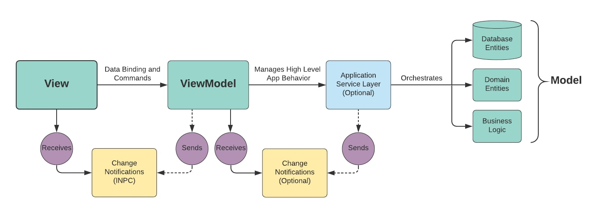
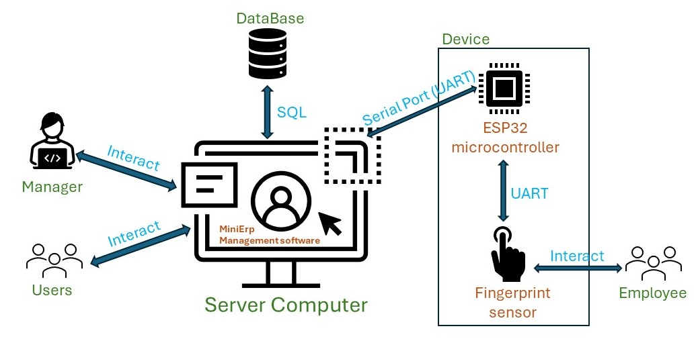

# MiniErp
 

# Migration

cd .\MiniErp.DbMigrator  

dotnet ef database update  

# Build
Update connectionString trong file appsettings.json đúng với database đang sử dụng 

Run migration 

Sau đó Run project MiniErp.UI 

# Kiến trúc MVVM

## Model
Phần dữ liệu của hệ thống gồm các data entities của cơ sở dữ liệu trong project MiniErp.Domain và các model data (DTO) sử dụng trong hệ thống trong folder Models project MiniErp.UI
## View
Phần giao diện người dùng. Project MiniErp.UI folder Views

## ViewModel
Phần xử lý nghiệp vụ, thực hiện xử lý dữ liệu
Xử lý các tương tác của người dùng qua ViewModel, mỗi View dùng 1 ViewModel, Model là data để ViewModel sử dụng, tương tác thông qua các Command

# Kiến trúc phần cứng

